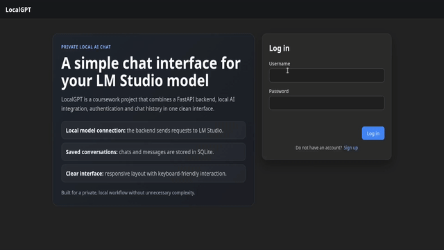

# LocalGPT

LocalGPT is a local AI chat web app built with FastAPI, SQLite, and a static frontend. It provides user registration, JWT login, per-user chat history, admin user management, and an LM Studio/OpenAI-compatible chat backend.



## Features

- FastAPI backend with static frontend serving
- Register/login flow with bcrypt password hashing and JWT sessions
- SQLite persistence for users, chats, and messages
- Chat history, generated chat titles, rename, and delete actions
- Admin endpoints for user listing, promotion, demotion, deletion, and stats
- Responsive frontend with landing page, chat UI, favicon, robots.txt, and sitemap.xml
- LM Studio integration through an OpenAI-compatible local HTTP endpoint

## Project Structure

```text
app/
  main.py        FastAPI app, static file routes, health check
  auth.py        Registration, login, JWT, admin guards
  api.py         Chat and admin API endpoints
  database.py    SQLite models, session handling, simple migrations
frontend/
  index.html     Public landing page
  app.html       Authenticated chat shell
  style.css      Shared styling
  script.js      Landing/auth behavior
  app.js         Chat application behavior
```

## Requirements

- Python 3.10+
- LM Studio or another OpenAI-compatible local chat completion server

Install Python dependencies:

```bash
python3 -m venv .venv
source .venv/bin/activate
python -m pip install --upgrade pip
python -m pip install -r requirements.txt
```

## Configuration

Create runtime environment variables from the example:

```bash
cp .env.example .env
```

Then edit `.env` and set a strong `SECRET_KEY`. For local shell startup:

```bash
set -a
source .env
set +a
```

The default model endpoint expects LM Studio at:

```text
http://127.0.0.1:1234/v1/chat/completions
```

## Run

Start the backend:

```bash
uvicorn app.main:app --reload --host 127.0.0.1 --port 8000
```

Open:

- App: `http://127.0.0.1:8000`
- API docs: `http://127.0.0.1:8000/docs`
- Health check: `http://127.0.0.1:8000/health`

The first registered user becomes an admin.

## Notes

- `app/localgpt.db` is created automatically at runtime and is intentionally ignored by Git.
- The setup scripts create virtual environments and can start `uvicorn`; this repository history commits the generated project files, not dependency folders.

## License

[MIT License](LICENSE) © 2026 Devids Kronbergs.
